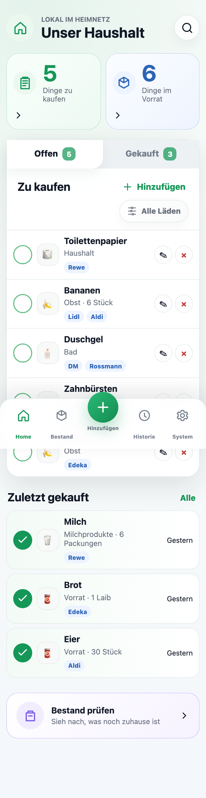
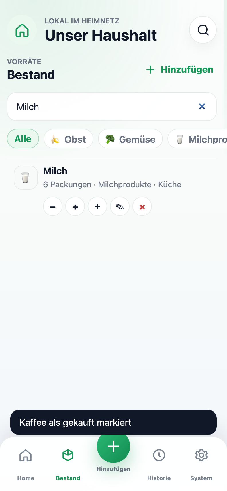
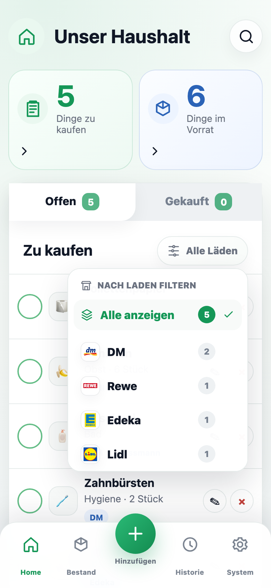

# 🏠 Household Manager

> A mobile-first household app for shared shopping lists and a clear pantry overview — no accounts, no forced cloud.

**Household Manager** is the shared memory for your home. Everyone can jot down what's missing in seconds — groceries, bathroom supplies or household goods — and check items off while shopping. Purchased items move automatically into the history and, optionally, into your pantry stock.

The app is built for the phone — in the supermarket, in the kitchen, or quickly from the couch — and runs entirely on your own network or server, so your data stays with you.

> 🇩🇪 The app's interface is in **German** (built for a German household). This README is in English for a wider audience.

---

## 📱 Screenshots

<p align="center">
  
  &nbsp;&nbsp;
  
  &nbsp;&nbsp;
  
</p>

---

## ✨ Features

- 🛒 **Shared shopping list** — add an item in under 5 seconds, check it off in under 2.
- 📦 **Pantry overview** — see at a glance what's still at home and what's running low.
- 🏪 **Multiple shops** — assign items to stores (DM, Rewe, Lidl, Edeka, Aldi, Rossmann, Hornbach …) and filter the list to match where you're shopping.
- 📸 **Photos & categories** — optional product photos and categories for faster recognition.
- 🕑 **History** — purchased items leave the open list but stay traceable.
- 📲 **Mobile-first** — a calm, bright interface with a prominent quick-add button and bottom navigation.
- 🔒 **Local & account-free** — runs on your own network or server; no sign-up, no cloud lock-in.

---

## 🚀 Run locally

Requirement: **Python 3** — that's it (the app only uses the standard library).

```bash
PORT=4173 HOUSEHOLD_DATA_DIR=./data python3 server.py
```

Then open in your browser:

```text
http://127.0.0.1:4173
```

## 🐳 Run with Docker

```bash
docker compose up --build
```

The app is then available at [http://localhost:8080](http://localhost:8080).
The SQLite database is stored in the `household-data` Docker volume and persists across restarts.

---

## 🧱 Tech stack

| Area       | Used                                       |
|------------|--------------------------------------------|
| Backend    | Python (standard-library `http.server`)    |
| Frontend   | HTML, CSS, vanilla JavaScript              |
| Database   | SQLite                                     |
| Deployment | Docker / Docker Compose                    |

## 📂 Project structure

```text
├── server.py          # Backend: serves the app and stores state in SQLite
├── index.html         # Interface
├── styles.css         # Styling
├── app.js             # Frontend logic
├── assets/            # Shop logos (DM, Rewe, Lidl, Hornbach, …)
├── screenshots/       # Screenshots used in this README
├── docs/              # Design reference
├── Dockerfile         # Container build
├── docker-compose.yml # Local / server start via Compose
└── project-idea.md    # Product & design concept (German)
```

## 🧪 QA

With the server running, a smoke test checks the core mobile flows (adding, photo upload, purchasing, inventory search, settings, server-side persistence):

```bash
QA_BASE_URL=http://127.0.0.1:4173 node qa-smoke.js
```

---

<p align="center"><em>Calm. Fast. Made for everyday life.</em></p>
