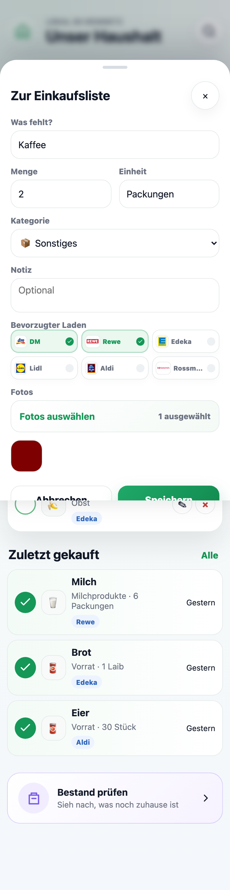
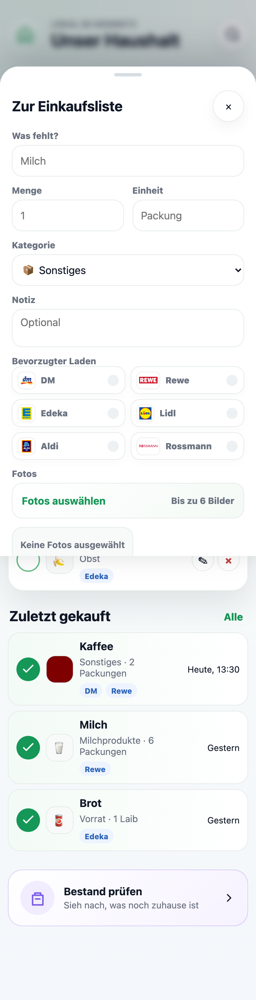

# 🏠 Household Manager

> Mobile-first Haushalts-App für gemeinsame Einkaufslisten und eine übersichtliche Vorratshaltung – ohne Accounts, ohne Cloud-Zwang.

**Household Manager** ist das gemeinsame Gedächtnis für deinen Haushalt. Alle notieren in Sekunden, was fehlt – Lebensmittel, Badartikel oder Haushaltswaren – und beim Einkaufen wird die Liste einfach abgehakt. Gekaufte Dinge wandern automatisch in die Historie und optional in den Vorrat.

Die komplette Oberfläche ist auf **Deutsch** und für die Nutzung am Smartphone optimiert: im Supermarkt, in der Küche oder schnell vom Sofa aus.

---

## 📱 Screenshots

<p align="center">
  
  
  
  
</p>

---

## ✨ Funktionen

- 🛒 **Gemeinsame Einkaufsliste** – in unter 5 Sekunden einen Eintrag hinzufügen, in unter 2 Sekunden abhaken.
- 📦 **Vorratsübersicht** – sieh auf einen Blick, was zuhause noch da ist und was zur Neige geht.
- 🏪 **Mehrere Läden** – ordne Einträge Geschäften zu (DM, Rewe, Lidl, Edeka, Aldi, Rossmann …) und sortiere die Liste passend zum Einkauf.
- 📸 **Fotos & Kategorien** – optionale Produktfotos und Kategorien für schnelleres Wiederfinden.
- 🕑 **Historie** – gekaufte Artikel verschwinden aus der offenen Liste, bleiben aber nachvollziehbar.
- 📲 **Mobile-first** – helle, ruhige Oberfläche mit großer Plus-Aktion und Bottom-Navigation.
- 🔒 **Lokal & ohne Accounts** – läuft im eigenen Netzwerk oder auf dem eigenen Server, deine Daten bleiben bei dir.

---

## 🚀 Lokal starten

Voraussetzung: **Python 3** (mehr braucht es nicht – die App nutzt nur die Standardbibliothek).

```bash
PORT=4173 HOUSEHOLD_DATA_DIR=./data python3 server.py
```

Dann im Browser öffnen:

```text
http://127.0.0.1:4173
```

## 🐳 Mit Docker

```bash
docker compose up --build
```

Die App läuft anschließend unter [http://localhost:8080](http://localhost:8080).
Die SQLite-Datenbank wird im Docker-Volume `household-data` gespeichert und bleibt zwischen Neustarts erhalten.

---

## 🧱 Technik

| Bereich    | Eingesetzt                                |
|------------|-------------------------------------------|
| Backend    | Python (Standardbibliothek `http.server`) |
| Frontend   | HTML, CSS, Vanilla JavaScript             |
| Datenbank  | SQLite                                    |
| Deployment | Docker / Docker Compose                   |

## 📂 Projektstruktur

```text
├── server.py          # Backend: serviert die App und speichert den Zustand in SQLite
├── index.html         # Oberfläche
├── styles.css         # Styling
├── app.js             # Frontend-Logik
├── assets/            # Laden-Logos (DM, Rewe, Lidl, …)
├── Dockerfile         # Container-Build
├── docker-compose.yml # Lokaler/Server-Start per Compose
└── project-idea.md    # Produkt- und Designkonzept
```

## 🧪 QA

Mit laufendem Server prüft ein Smoke-Test die mobilen Kernflows (Hinzufügen, Foto-Upload, Kaufen, Bestandssuche, Einstellungen, serverseitige Persistenz):

```bash
QA_BASE_URL=http://127.0.0.1:4173 node qa-smoke.js
```

---

<p align="center"><em>Ruhig. Schnell. Alltagstauglich.</em></p>
